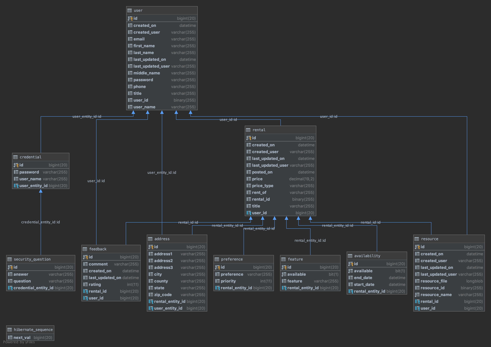

## Chautari Rental Service [](https://www.codacy.com/gh/e-Mela/chautari?utm_source=github.com&amp;utm_medium=referral&amp;utm_content=e-Mela/chautari&amp;utm_campaign=Badge_Grade)
This is a rental platform back-end application.

#### Chautari Service API:


### Database:
Chautari uses MySQL database to store service entities.

#### DB connection:

Add following connection properties in `application.properties` file

```properties
spring.datasource.url=jdbc:mysql://<host-url>:3306/<db-name>
spring.datasource.username=<user>
spring.datasource.password=<password>
spring.datasource.driver-class-name=com.mysql.jdbc.Driver
spring.jpa.database-platform=org.hibernate.dialect.MySQL5InnoDBDialect
```

#### ER diagram:


 
 
